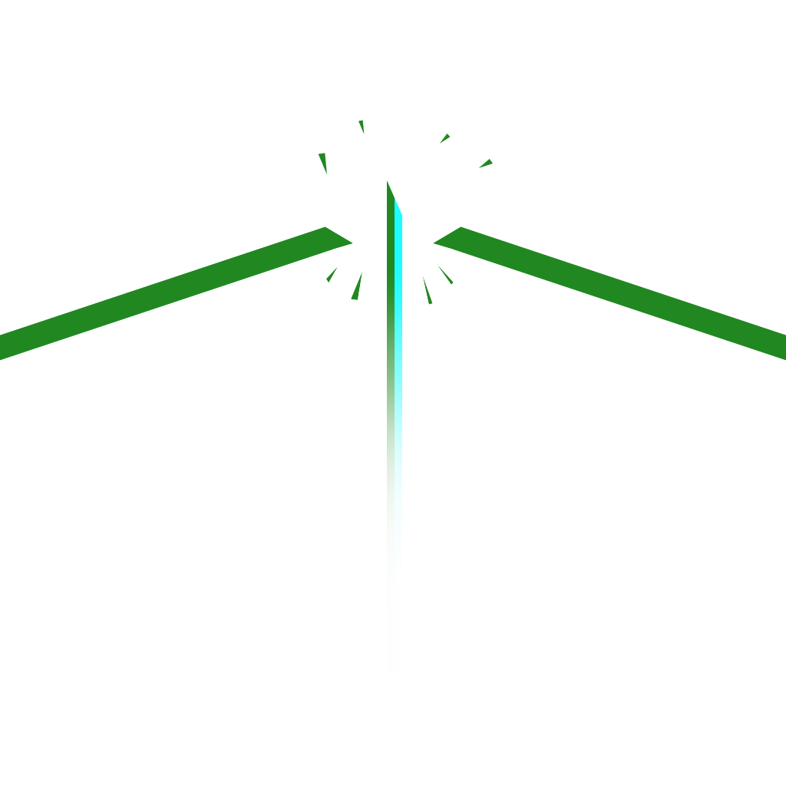

<p align=center></p>

<h1 align=center>Graviton Programming language</h1>

[](https://crates.io/crates/graviton)
[](./LICENSE)
[](https://travis-ci.org/Ralakus/graviton)
[](https://github.com/Ralakus/graviton/issues)
[](https://github.com/Ralakus/graviton)
[](https://github.com/Ralakus/graviton)

## Build requirements
* Rust nightly with cargo

## How to build 
0. Run `cargo build`

## What is Graviton?
Graviton is a fast programming language that is minimal and simplistic with a simple and easy to read compiler. Everything is an expression unless a semicolon is used `;` then it becomes a statement which gives a clear distinction between expressions and statements.  
Graviton is still under heavy development so it is bound to have breaking changes

## Examples
[Iterative fibonacci example](./examples/fib.grav) 
```rust

import "/std";

println("Iterative Fibonacci example");

let fib = (n: I32) {
    let mut prevprevn = 0;
    let mut prevn = 0;
    let mut curn = 1;

    let mut i = 2;

    while i <= n {

        prevprevn = prevn;

        prevn = curn;

        curn = prevprevn + prevn;

        i = i + 1;

    };

    curn
};

print("Enter a number: ");
let n = read_num();

let fib_number: I32 = fib(n);

let output = if fib_number != fib(14) {
        fib_number
    } else {
        println("Input was 14 so result will be negated for demonstration");
        -fib_number
    };

print("Fibonacci of ");
printn(n);
print(" is ");
printnln(fib(n));
println("");
```

## How can follow the progress?
* There is a [Trello](https://trello.com/b/Z2PQHhgy/graviton) board set up for this project